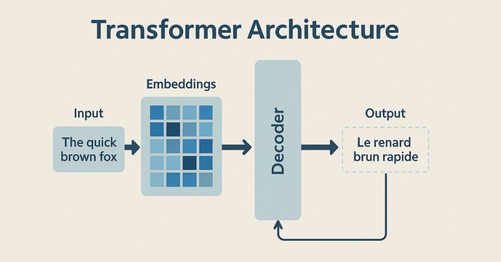

# Session 08: Diffusion Models for Image Generation

### Introduction: Revisiting Transformers and Embeddings

- Quick recap on **Transformers**, embedding spaces, and encoder-decoder architectures.

### Today’s Topic

- **Diffusion Models for Image Generation** [(Diffusion Demo)](https://www.kaggle.com/code/nasr73222/diffusion-session)

### Key Differences from Transformers

1. Move from understanding text to understanding images.
2. Focus on generating new images from learned data.

***

## Part 1: Understanding Text as Images

#### Historical Context

- In 2020, AI made massive leaps with GPT-3 in text. Researchers aimed to bring these ideas to images.

#### CLIP: Connecting Text and Vision

- **OpenAI’s CLIP (Contrastive Language-Image Pre-Training)** [(paper link)](https://arxiv.org/pdf/2103.00020), [(open AI)](https://openai.com/index/clip/)
- CLIP is trained on 400M internet-crawled image-caption pairs.

**How was CLIP trained?**

- For each image-caption pair:
    - Minimize loss for matching pairs
    - Maximize loss for mismatched ones
    - Uses _cosine similarity_ between image and text embeddings.

**Cosine Similarity Function:**

$$
\cos(\theta) = \frac{\vec{A} \cdot \vec{B}}{ \| \vec{A} \| \| \vec{B} \| }
$$

**Contrastive Loss Function:**

**Goal:** Make the embedding of a matching image-text pair $$(\mathbf{e}_I, \mathbf{e}_T)$$ close together, and push apart non-matching pairs.

$$
\mathcal{L}_{contrastive} = -\log \frac{\exp(\cos(\mathbf{e}_I, \mathbf{e}_T) / \tau)}{\sum_{j=1}^{N} \exp(\cos(\mathbf{e}_I, \mathbf{e}_{T_j}) / \tau)}
$$

- **$\tau$**: Hyperparameter that scales the cosine similarity scores before they are passed into the softmax function.

**Shared embedding space:**

- Both pictures and captions are represented as vectors close together if paired.

**Demo 1:**

- Applications of the shared embedding space.

**Demo 2:**

- Zero-shot classification using only textual prompts.

***

## Part 2: Image Generation

#### Background

- Generating realistic images has been a problem for decades.
- Previous approaches:
    - **Autoencoders (AEs):** encode and reconstruct images via compression
    

    - **GANs (Generative Adversarial Networks):** generate sharp, realistic images using an adversarial approach
    [(This Person Does Not Exist)](https://thispersondoesnotexist.com)
    

***

#### Enter Diffusion Models

- Named after the diffusion process from chemistry
- Might seem straight forward at the start.
- Denoise images and train a network to reverse the noise step right?

- In 2020, the **DDPM** paper introduced a new approach [(paper link)](https://arxiv.org/pdf/2006.11239)
- Implementation from the paper suggests otherwise 

**Explanation of Symbols in DDPM Training & Sampling Algorithms:**

- **$x_0$**: Original data sample (e.g., an image from the dataset).
- **$q(x_0)$**: Data distribution (how real images are distributed).
- **$t$**: Discrete time step (from $1$ to $T$), representing the amount of noise added.
- **$T$**: Total number of diffusion steps.
- **$\epsilon$**: Random noise sampled from a standard normal distribution $\mathcal{N}(0, I)$.
- **$\alpha_t$**: Noise schedule parameter at step $t$ (controls how much noise is added at each step).
- **$\bar{\alpha}_t$**: Cumulative product of $\alpha_t$ up to step $t$.
- **$\epsilon_\theta(x, t)$**: Neural network predicting the noise component at step $t$ for input $x$.
- **$z$**: Random noise for stochasticity in sampling (set to $0$ at the last step).
- **$\sigma_t$**: Standard deviation for added noise at step $t$ during sampling.

**Training (Algorithm 1):**
1. Sample a real image $x_0$ from the dataset.
2. Pick a random timestep $t$.
3. Sample random noise $\epsilon$.
4. Create a noisy image using $x_t = \sqrt{\bar{\alpha}_t} x_0 + \sqrt{1-\bar{\alpha}_t} \epsilon$.
5. Train the model $\epsilon_\theta$ to predict the noise $\epsilon$ from the noisy image $x_t$ and timestep $t$.

**Sampling (Algorithm 2):**
1. Start from pure noise $x_T$.
2. For each timestep $t$ (from $T$ down to $1$):
    - Predict the noise $\epsilon_\theta(x_t, t)$.
    - Compute a less noisy image $x_{t-1}$ using the reverse process equation.
    - Add random noise $z$ (except at the final step).
3. Return $x_0$ as the generated image.

**The actual process involves 2 unusual steps:**
1. Predicting the total **added noise**, not just the previous denoised step.

2. Adding noise with every generation step.

***

### Visualizing Diffusion

- Points on a simple 2D grid represents images, they start in their original structure of readable images.

- As noise is added, they “random walk” away from their structure turning into noisy images.

    
    
    

- In general, diffusion models are **trained to reverse** this process.

***

#### Why Not Reverse Step by Step?

- Instead of predicting the small amount of noise to go from `x_t` to `x_{t-1}`, the model is trained to predict the **total noise** (`ε`) that was added to the original image `x_0` to create `x_t`.
- **Why this works:** The noisy image `x_t` is a direct combination of the original image `x_0` and the total noise `ε`. If the model can predict `ε` from `x_t`, it can also estimate the original `x_0`.
- **Equivalence:** Knowing the start (`x_0`) and end (`x_t`) points allows you to calculate any intermediate step (like `x_{t-1}`). Therefore, predicting the total noise `ε` is mathematically equivalent to predicting the noise needed for a single step back.
- **Benefits:** This approach simplifies the model's objective. It has one consistent goal for every timestep `t`: find the original noise `ε`. This makes training more stable and efficient.

#### Score Function

- We now have a score function producing  a feild that guides the points to move to the original locations.

$$
x_{0} = f(x_{100})
$$

#### Introducing **t**: The Time Parameter

- If noise steps are larger, the overall predicted feild for a pixel will point to the mean.
- if noise steps are smaller, the predicted feild will be refined pointing to the actuall structure of the data.
- Adding **t** as an input allows for **time-variant vector field** prediction — a flow-based model.
    - The vector field changes and becomes more detailed as $t (1 \rightarrow 0)$, restoring the original image structure.

$$
x_{0} = f(x_{100}, t=1.0)
$$

#### Randomness in Diffusion

- Why inject more randomness in the reverse step?
    - **Without random noise:** Images look blurry; all points move to the center (mean).
    - **With random noise:** Model produces diverse, high-quality images.
- The noise is gradually reduced as $ t \rightarrow 0 $ to allow for conversion.

***

#### Equations

**DDPM Forward/Noising Process:**

$$
x_t = \sqrt{\alpha_t} x_0 + \sqrt{1-\alpha_t} \epsilon, \quad \epsilon \sim \mathcal{N}(0, I)
$$

**Reverse/Sampling Process (Stochastic Differential Equation):**

$$
x_{t-1} = \frac{1}{\sqrt{\alpha_t}} \left( x_t - \frac{1- \alpha_t}{\sqrt{1-\bar{\alpha}_t}} \epsilon_\theta (x_t, t) \right) + \sigma_t z
$$

- $ \epsilon_\theta $ is the model's prediction of the noise
- $ z \sim \mathcal{N}(0, I) $ for stochasticity

***

### Improvement: DDIM

- The **DDIM** paper offered deterministic sampling [(paper link)](https://arxiv.org/abs/2010.02502)
- **Key change:**
    - No extra noise is added while sampling.
    - Method derived from mechanical engineering concepts.

**DDIM Equation:**

$$
x_{t-1} = \sqrt{\alpha_{t-1}} \left( \frac{x_t - \sqrt{1-\alpha_t} \epsilon_\theta(x_t, t)}{ \sqrt{\alpha_t} } \right) + \sqrt{1-\alpha_{t-1}} \epsilon_\theta(x_t, t)
$$

- Only sampling is changed; training remains the same.

***

### Adding Guidance: CLIP \& Prompts

- **Diffusion models** alone can only generate objects similar to training data.
- **2022:** DALL-E2 (see [paper](https://cdn.openai.com/papers/dall-e-2.pdf)) combines CLIP embeddings with diffusion.
    - Embedding is added into the diffusion process, conditioning the output to come up with certain images based on certain prompts.

$$
f(x_{100}, t, \text{class})
$$

- But this initially introduces conflict (good images vs desired class).

#### Classifier-Free Guidance

- Use two flows:
    $$
    f(x_{100}, t, class), f(x_{100}, t, no class)
    $$

- Combine with weighting:

$$
\text{Guided Output} = f(\text{with class}) + \alpha [f(\text{with class}) - f(\text{no class})]
$$

- Higher $\alpha$ makes prompt guidance stronger.

#### Negative Prompts

- Further improved guidance:
    - Subtract unwanted class flows to actively repel certain outcomes.
- Visual demo with and without negative prompts

**Prompt:** A photorealistic, ultra-detailed portrait of a wise old wizard with a long white beard, holding a glowing crystal orb, set in a magical library filled with ancient books.

**Negative Prompt:** cartoon, drawing, painting, blurry, low quality, ugly, disfigured, bad anatomy, extra limbs, missing fingers, watermark, text, signature.

***

### Other Modern Diffusion Models

- to be added 
***

### Thank You!